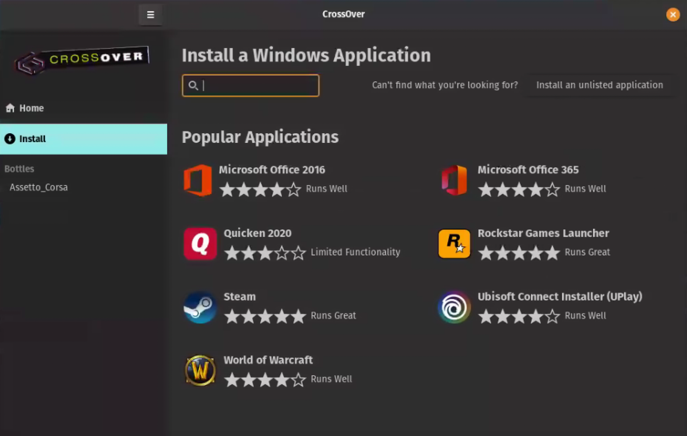
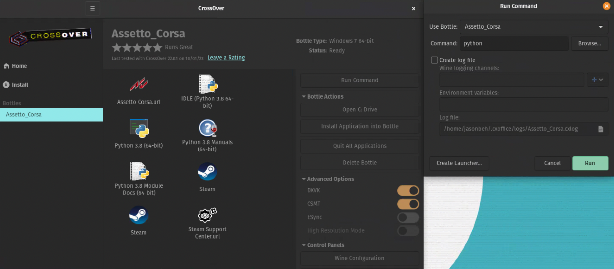

# Installation Steps

## Required Applications
| Application | Description | Notes |
|---|---|---|
| [CrossOver](https://www.codeweavers.com/crossover) | Compatibility Tool which allows the host computer to run Windows application on MacOS, Linux and ChromeOS. | There is a free trial, but it is not free. |
| [Python](https://www.python.org/downloads/windows/) | Programming Language to run the autonomous racing agent. | The Python installer must be compatible for Windows 7 (64-bit).  |
| [Anaconda](https://www.anaconda.com/) | An open-source, package manager and environment management system. | - |
| [Linux](https://www.linux.org/pages/download/) | Base operating system for setup. | - |
| [Assetto Corsa](https://store.steampowered.com/app/244210/Assetto_Corsa/) | Windows-based racing game that is hosted on Steam | Game is not free. |

At the time of creating these steps, the exact specification are as follows:
- [Python 3.8.8](https://www.python.org/downloads/release/python-388/)
- [CrossOver 22.1.0](https://www.codeweavers.com/crossover)
- [Pop!_OS 20.04 LTS](https://pop.system76.com/) (FYI: Pop!_OS is based on Ubuntu)

## Steps

1. Download Python and CrossOver. Install CrossOver and Anaconda in your machine. Buy Assetto Corsa.
2. Install Assetto Corsa
   - Click on the Install tab on the left and type `Assetto Corsa`. 
   
   - Click the green Install button.
   
   - Click Yes to everything.
     - It will build a 'container' (this is called a "[bottle](https://news.ycombinator.com/item?id=29613303#:~:text=software%20on%20...-,Bottles%20are%20isolated%20Wine%20environments%2C%20similar%20to%20containers%20or%20VMs,%2C%202021%20%7C%20next%20%5B%E2%80%93%5D)", see [Wine](https://www.winehq.org/) for details).
     - **IMPORTANT**: When prompted to start Steam during the installation process, click Yes and sign in. Once you have signed in, it will prompt you to install Assetto Corsa.
     - If you do not have Assetto Corsa, then it is available via [Humble Bundle](https://www.humblebundle.com/store/assetto-corsa) or [Steam](https://store.steampowered.com/app/244210/Assetto_Corsa/).

3. Install Python in the same Wine bottle as Assetto Corsa.
   - Click on the Install tab on the left and proceed to click on `Install an unlisted application` on the top right.
   
   - Choose to install the Python Windows Installer in the same Wine bottle as Assetto Corsa. 
     - Do not create another wine bottle and make sure it is compatible with Windows 7 (64-bit). 
     - It is also important to add Python to `PATH` in the first page and tick `Install Python for all users` in the Advanced Options page.
     
   - Verification Step:
     - In CrossOver, click on the Assetto Corsa bottle on the left and click `Run Command`. Type `python` in the Command field and click `Run`. 
    
     - You should be able to see an interactive Python shell if successful.
   - Key Notes:
     - Assetto Corsa has to run in Wine, which means we cannot directly access the game state via shared memory. We use a Python script running inside of the same Wine instance to get the game state and make it available to the host OS via a socket.
     - Assetto Corsa is compatible in Windows 7 (64-bit) Wine bottle only. Therefore, there is a need to find a compatible Python version.
     
4. Clone repository onto the Linux machine using Git.

5. Navigate into the directory and install the conda environment.
```bash
make build
```

6. Make sure the Python uinput module has access to the kernel uinput module.
```bash
sudo modprobe uinput
sudo chmod a+r+w /dev/uinput
```

7. Install the Assetto Corsa interface in the Wine bottle.

- Navigate to the root directory of the package and run the command to access the command line in the bottle:
  ```bash
  /opt/cxoffice/bin/wine --bottle Assetto_Corsa --cx-app cmd.exe
  ```
- Install using pip:
  ```bash
  pip install loguru numpy
  pip install -e .
  ```

## Verification

1. Activate conda environment in the root directory of the repository.
```bash
conda activate {CONDA_ENV_PATH}
```

You can view all environments using
```bash
conda env list
```

2. Run the random action agent in the root directory of repository.
```bash
DISPLAY=:1 python examples/random_agent.py
```

The `DISPLAY` set the os environment in Python to target the chosen display.

## FAQ

### 1. Resolution Issues

Additionally, if the game resolution is set to be the same as your windowed resolution, i.e. you have a 1920x1080 screen, and in AC you disable fullscreen mode (enabling windowed mode) and set the resolution to be 1920x1080, AC will ignore your windowed mode request and thus our scripts won't be able to do game capture. So you will need to set the game resolution to something smaller than your display, i.e. 1920x1080 screen, so 1600x900 game resolution. You will need to go into src/config/capture/game_capture.yaml and change the resolution to the one chosen in game.

### 2. Slow image write during Recording
Prior to running `make build`, we need to make sure an additional package is installed by running 
```bash
sudo apt-get install libturbojpeg
```
This step allows the interface to write out image files in a faster manner.

### 3. Agent script is running but no action is made
- Add a package by running
```bash
sudo apt-get install xboxdrv
```
- Restart the Linux machine
- Launch Assetto Corsa and go to Settings > Controls
- Apply the Xbox360 controller preset
- Relaunch the game and try running the agent.
